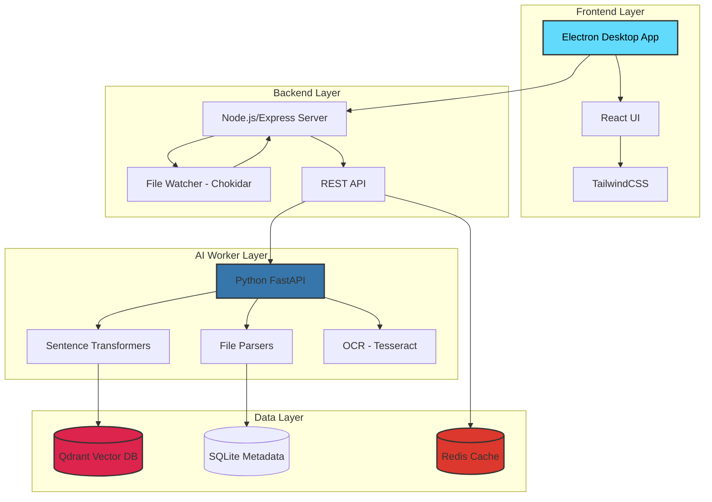
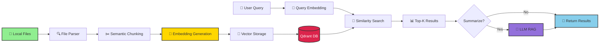
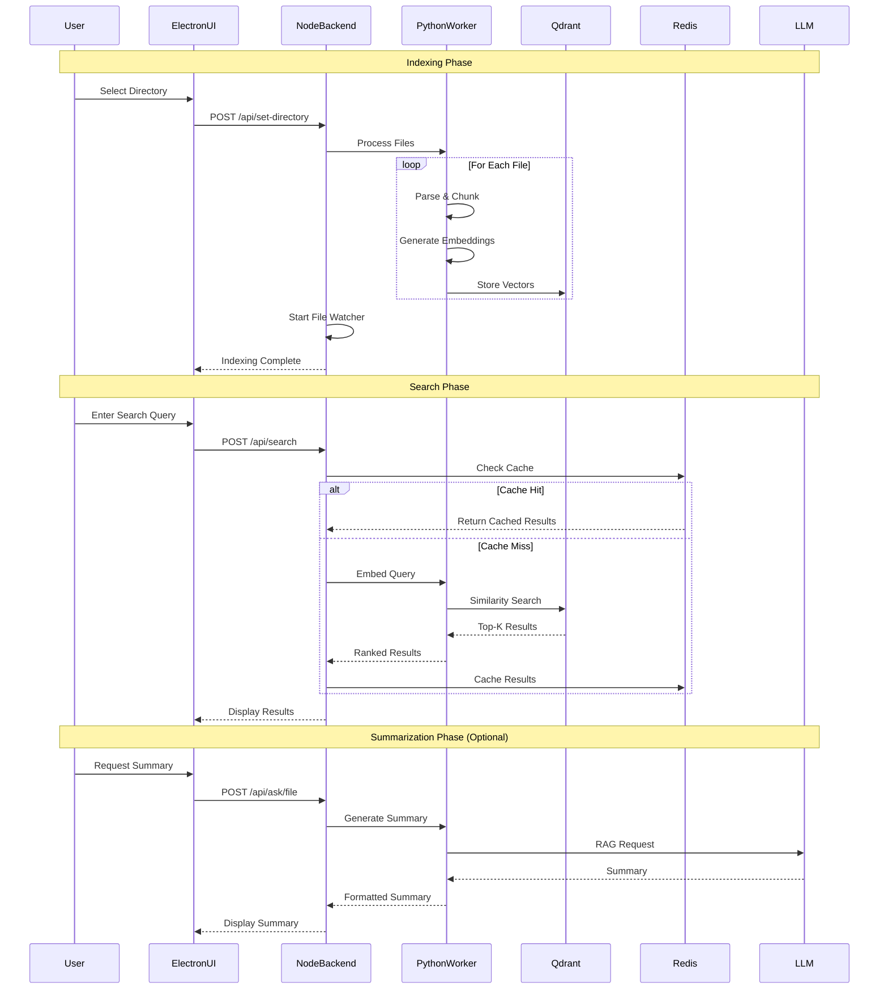
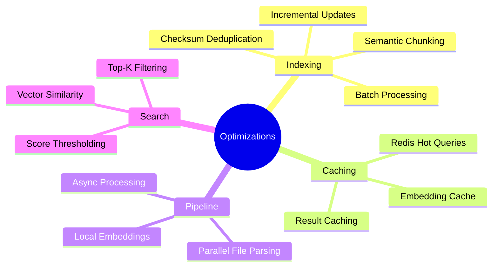
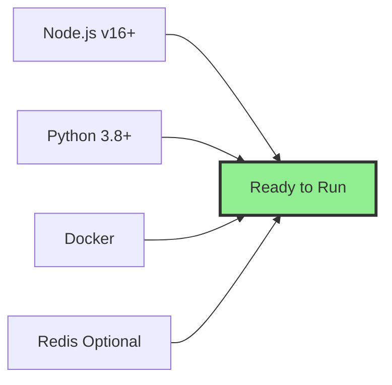

<div align="center">

# 🔍 ArcticFiles (SFE)

### **Google for Your Computer — Semantic Search for Local Files**

[](https://python.org)
[](https://nodejs.org)
[](https://reactjs.org)
[](https://electronjs.org)

[](https://qdrant.tech)
[](https://huggingface.co)


</div>

---

ArcticFiles (SFE) is a desktop application that enables **meaning-based search** across local files instead of relying on filenames or exact keyword matches. The system uses NLP embeddings, vector search, and optional AI summarization to help users retrieve documents faster and understand their contents instantly.


---

## 📋 Problem

Traditional file explorers search using:
- Filenames
- Folder hierarchy
- Exact keyword matching

However, users usually remember:
- Ideas
- Topics
- Context
- Approximate descriptions

### Example
A user remembers **"budget report from last month"** but not the filename.

This mismatch makes file retrieval inefficient.

---

## ✨ Solution

ArcticFiles replaces keyword search with **semantic similarity search** using embeddings and vector databases.

**Instead of:**
```
filename → keyword match
```

**We do:**
```
file content → embeddings → vector similarity → ranked results
```

The application also supports:
- Preview snippets
- Real-time indexing
- AI summarization
- Local-first privacy model

---

## 🚀 Features

- ✅ **Semantic search** across local files
- 📄 Supports **PDF, DOCX, TXT, PPTX, XLSX, MP3, MP4, Code files (Java, C, C++, HTML, CSS, React), and images (OCR)**
- 🔄 **Real-time file watcher** for auto-indexing (Chokidar)
- 🔐 **Multi-user Authentication** for private, isolated workspaces
- 🔍 **Vector search** using Qdrant
- 👀 **Preview snippets & Syntax Highlighting** for documents and code
- 🤖 **AI summarization & Ask AI** powered by Gemini 3.8 Flash
  - Single file summary
  - Ask questions based on search results
- 🎧 **AI Podcast Generation** via edge-tts (100% Free text-to-speech)
- ⚡ **Redis caching** for frequent queries
- 🔒 **Local-first architecture** with optional cloud AI

---

## 🛠️ Tech Stack

### Frontend
- **Electron**
- **React**
- **TailwindCSS**

### Backend
- **Node.js**
- **Express**

### AI Worker
- **Python**
- **FastAPI**
- **Sentence Transformers**
- **PyMuPDF**
- **python-docx**
- **Tesseract OCR**

### Databases
- **Qdrant** (Vector DB)
- **SQLite** (metadata & users)
- **Redis** (cache)

### AI Models
- **SentenceTransformers** embeddings (Local)
- **Gemini 3.8 Flash** for summarization, insights, and podcast generation (Free Tier)
- **edge-tts** for voice/podcast generation (Local/Free)

---

## 🏗️ Architecture



---

## 🔬 NLP Pipeline



### Pipeline Breakdown:

| Stage | Description | Technology |
|-------|-------------|------------|
| 📄 **Parsing** | Extract text from various file formats | PyMuPDF, python-docx, python-pptx, Whisper, Tesseract |
| ✂️ **Chunking** | Split content into semantic segments | Custom semantic splitter |
| 🧠 **Embedding** | Convert text to vector representations | SentenceTransformers |
| 💾 **Storage** | Store vectors for fast retrieval | Qdrant Vector DB |
| 🔍 **Search** | Find semantically similar documents | Cosine similarity |
| 🤖 **AI Features** | Generate summaries, Q&A, and Podcasts | Gemini 3.8 Flash & edge-tts |

---

## 📂 System Workflow



---

## 💡 Example Queries

<table>
<tr>
<td width="50%">

### 📝 Document Search
```
"Barcelona trip notes"
```
✅ Finds: `vacation_2024.docx`, `travel_journal.pdf`

```
"heart disease research"
```
✅ Finds: `cardiology_study.pdf`, `medical_notes_02.txt`

</td>
<td width="50%">

### 💻 Code Search
```
"authentication code logic"
```
✅ Finds: `auth.js`, `login_handler.py`

```
"database connection setup"
```
✅ Finds: `db_config.js`, `models/index.py`

</td>
</tr>
<tr>
<td colspan="2">

### 🎯 The Power of Semantic Search
> **These queries work even when filenames do not contain those words!**
>
> Traditional search: `budget_Q4_2025_final_v2.xlsx` ❌  
> Semantic search: *"last quarter financial report"* ✅

</td>
</tr>
</table>

---

## ⚡ Performance Optimizations



### Key Optimizations

| Technique | Impact | Implementation |
|-----------|--------|----------------|
| 🧩 **Semantic Chunking** | 40% better accuracy | Context-aware splitting vs fixed tokens |
| ⚡ **Batch Indexing** | 3x faster | 500ms debounce, bulk operations |
| 🔒 **Checksum Deduplication** | 60% fewer re-indexes | SHA-256 file comparison |
| 🚀 **Redis Caching** | 10x faster repeats | Cache hot queries for 1 hour |
| 💻 **Local Embeddings** | No API costs | SentenceTransformers on-device |
| ☁️ **Optional Cloud LLM** | Better summaries | Only when needed |

---

## 🎯 Use Cases

<table>
<tr>
<td align="center" width="25%">

### 🎓 Students


**Find notes by topic**  
Instead of filenames

*"calculus derivatives"*  
*"world war 2 summary"*

</td>
<td align="center" width="25%">

### 👨‍💻 Developers


**Search code by logic**  
Instead of file structure

*"JWT validation"*  
*"payment processing"*

</td>
<td align="center" width="25%">

### 🔬 Researchers


**Locate docs by concept**  
Instead of keywords

*"neural networks"*  
*"climate change data"*

</td>
<td align="center" width="25%">

### 💼 Professionals


**Retrieve reports by context**  
Instead of dates

*"Q3 sales report"*  
*"client feedback"*

</td>
</tr>
</table>

---

## 🚀 Installation & Setup

### Prerequisites



### Quick Start

#### 1️⃣ Clone Repository
```bash
git clone https://github.com/shivamjha10k/arcticfiles.git
cd arcticfiles
```

#### 2️⃣ Start Vector Database
```bash
docker run -d -p 6333:6333 qdrant/qdrant
```

#### 3️⃣ Setup Python Worker
```bash
cd worker
pip install -r requirements.txt
uvicorn main:app --reload --host 0.0.0.0 --port 8000
```

#### 4️⃣ Setup Node.js Backend
```bash
cd backend
npm install
npm start
```

#### 5️⃣ Launch Electron App
```bash
cd frontend
npm install
npm run electron:dev
```

### 🎉 You're Ready!
Open the app and select a directory to start indexing.

---

## 📡 API Endpoints

<details>
<summary><b>📂 Directory Management</b></summary>

| Method | Endpoint | Description |
|--------|----------|-------------|
| `POST` | `/api/set-directory` | Set directory for indexing |
| `GET` | `/api/directories` | List indexed directories |

**Example Request:**
```json
POST /api/set-directory
{
  "path": "/Users/john/Documents"
}
```

</details>

<details>
<summary><b>📄 File Operations</b></summary>

| Method | Endpoint | Description |
|--------|----------|-------------|
| `POST` | `/api/index-file` | Index a single file |
| `POST` | `/api/reindex-file` | Reindex existing file |
| `DELETE` | `/api/remove-file` | Remove file from index |

**Example Request:**
```json
POST /api/index-file
{
  "filePath": "/Users/john/Documents/report.pdf"
}
```

</details>

<details>
<summary><b>🔍 Search Operations</b></summary>

| Method | Endpoint | Description |
|--------|----------|-------------|
| `POST` | `/api/search` | Semantic search query |
| `GET` | `/api/file-preview` | Get file preview |

**Example Request:**
```json
POST /api/search
{
  "query": "machine learning algorithms",
  "limit": 10
}
```

**Example Response:**
```json
{
  "results": [
    {
      "filePath": "/Documents/ml_notes.pdf",
      "score": 0.89,
      "snippet": "...neural networks and deep learning..."
    }
  ]
}
```

</details>

<details>
<summary><b>🤖 AI Summarization</b></summary>

| Method | Endpoint | Description |
|--------|----------|-------------|
| `POST` | `/api/ask/file` | Summarize single file |
| `POST` | `/api/ask/top` | Compare top 3 results |

**Example Request:**
```json
POST /api/ask/file
{
  "filePath": "/Documents/report.pdf",
  "question": "What are the main findings?"
}
```

</details>

---


## 🔮 Future Improvements

- [ ] Cloud deployment option
- [ ] Plugin support
- [ ] Cross-platform packaging
- [ ] Smart tagging and recommendations
- [ ] Offline LLM support

---

## 📝 Conclusion

ArcticFiles transforms file search from a storage-based operation into a **knowledge retrieval experience**. By combining NLP embeddings, vector search, and AI summarization, it demonstrates how modern AI techniques can improve everyday computing workflows.

---

## 📄 License

[Add your license here]

## 🤝 Contributing

Contributions, issues, and feature requests are welcome!

## ⭐ Show Your Support

Give a ⭐️ if this project helped you!
